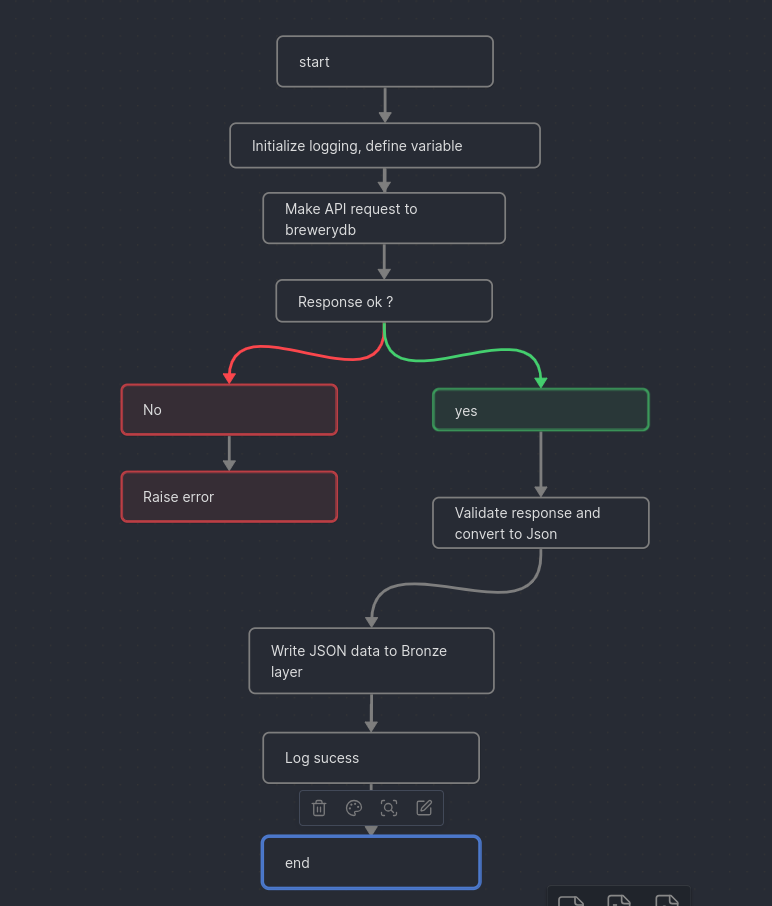
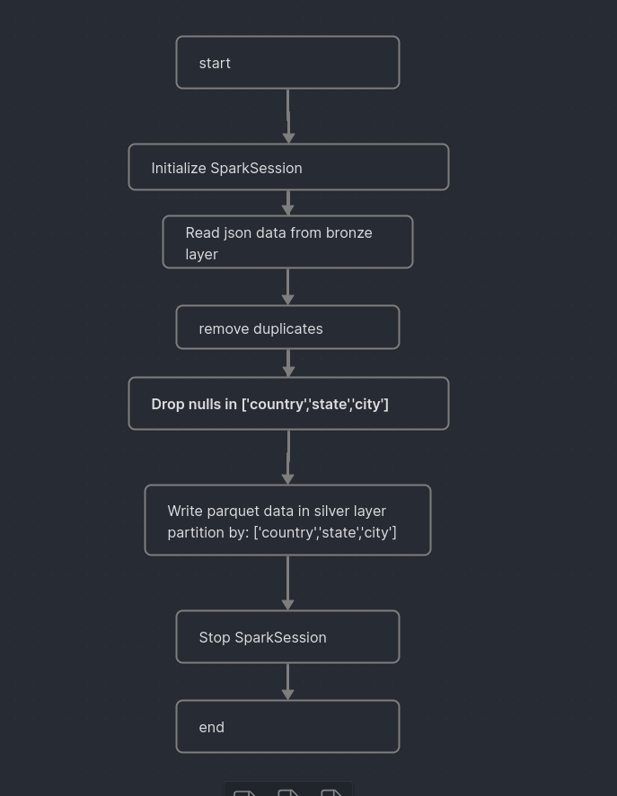
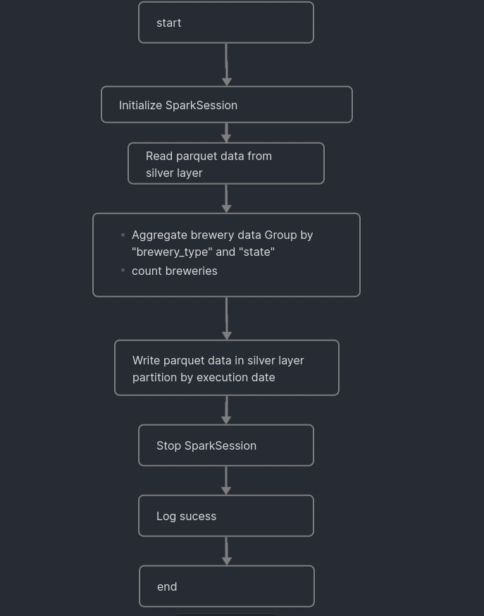
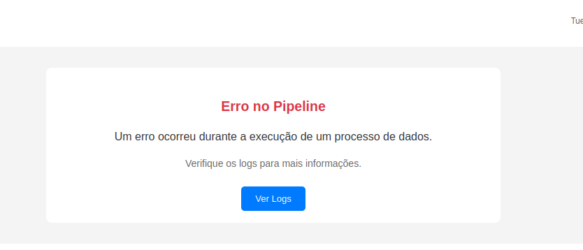
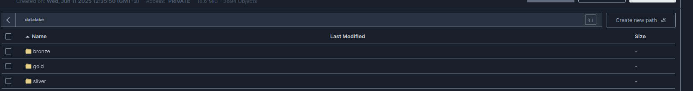

# BEES Data Engineering – Breweries Case
# Overview

This project implements a data engineering pipeline using Apache Airflow, Spark, and MinIO for extraction, transformation, and loading (ETL) of data from the Open Brewery DB. 
Architecture

## Architecture


    Airflow: Orchestrates the ETL pipelines.

    MinIO: Object storage (S3-compatible).

    Spark: data processing.

    Docker Compose: Manages the service containers.
### Project Structure
```
├── docker/
│   ├── dags/                # Airflow DAGs
│   ├── src/                 # Extraction and ETL scripts
│   ├── logs/                # Airflow logs
│   ├── minio/               # Persistent MinIO data
│   ├── Dockerfile           # Custom Airflow/Spark image
│   └── docker-compose.yml   # Service orchestration
├── README.md
├── pyproject.toml
└── init.sh
```
## Pipeline

### Extraction
Data is extracted from the Open Brewery DB via a REST API and saved to the datalake bucket in the bronze layer (bronze/data.json).

### Bronze → Silver
Raw data is cleaned and partitioned by country, state, and city, then saved in Parquet format in the silver layer (silver/).

### Silver → Gold
Data is aggregated by brewery type and state, and saved to the gold layer (gold/), partitioned by execution date.

### Error Handling
The pipeline includes mechanisms to handle errors effectively:
 - Task failures trigger email notifications using AWS SES.
 - Airflow's retry mechanism is configured to reattempt failed tasks.

# How to Run
### Prerequisites
* Docker and Docker Compose installed
* Python 3.12+ (for local development)
* Email notifications on failure use AWS SES. 
*  To enable this feature, set the environment variables AWS_ACCESS_KEY_ID_EMAIL and AWS_SECRET_ACCESS_KEY_EMAIL in the docker-compose.yml file and follow the instructs bellow

### How to Set Up Email Notifications (AWS SES Sandbox)

This project supports automatic email alerts for task failures using **Amazon SES (Simple Email Service)**. Below are the steps to configure email notifications in **sandbox mode**.

#### Step 1: Create and Verify Your AWS SES Email

1. Log in to the [AWS SES Console](https://console.aws.amazon.com/ses/home).
2. Select your region (e.g., `us-east-1`).
3. Go to **Email Addresses** under "Identity Management".
4. Click **Verify a New Email Address** and enter the email you want to use as sender.
5. Check your inbox and click the verification link.

> In sandbox mode, you must verify both **sender and recipient** email addresses.

#### Step 3: Add Credentials to docker-compose.yml

docker/docker-compose.yml, under the airflow service, add the SES credentials as environment variables:

```
services:
  airflow:
    environment:
      AWS_ACCESS_KEY_ID_EMAIL: your_access_key
      AWS_SECRET_ACCESS_KEY_EMAIL: your_secret_key
```
### Step 4: Set Sender and Recipient in Code

In the task_failure.py file, define the SENDER and RECIPIENT email addresses (both must be verified in sandbox):

```
    to_email="leoigornu@gmail.com",
    from_email="leoigornunes@gmail.com"
```
## How to run

```
git clone git@github.com:c4p1t4n/bees_data.git
```

```
chmod +x init.sh
```

```
./init.sh
```
Access the services:

    Airflow: http://localhost:8080

        Username: admin

        Password: admin

    MinIO: http://localhost:9001

        Username: airflowuser

        Password: airflowpass123

#### Running the Pipeline
Access the Airflow UI at http://localhost:8080, enable and trigger the extract_breweries_dag.


acess the MinIO MinIO: http://localhost:9001 and see the folders inside datalake

